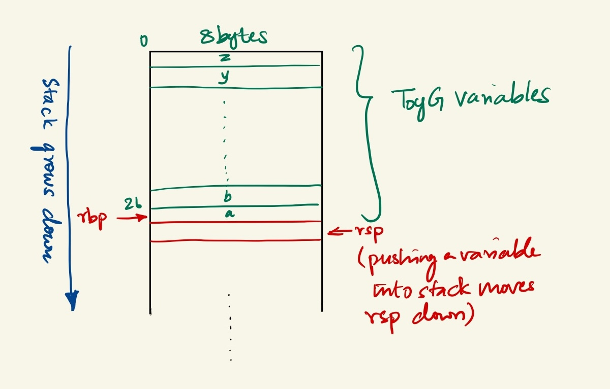

# Homework 9 - Code Generator using Lex and Yacc

{: .notice}
> From now on, we'll assume that you work on homework by connecting
> to the CS portal and that you are familiar with the command line
> environment.  If you have not been practicing with the terminal,
> we **strongly** encourage reviewing [Lab 1](../labs/lab1-ssh-ed.html).
>
> We will also assume that you ran the setup script from that lab
> and have all modules (including clang and git) by default.

In this assignment you will modify a Code Generator ([Wikipedia](https://en.wikipedia.org/wiki/Code_generation_(compiler))) that parses through an Abstract Syntax Tree ([Wikipedia](https://en.wikipedia.org/wiki/Abstract_syntax_tree)) generated by Lex and Yacc.
You will modify the code generator to emit x86 assembly. 
The first section of this article will introduce our custom toy language. 
The second section will introduce the code generator and walk you through the parts of it that you will be implementing in this homework.
The final section will introduce the tasks that need to be completed as a part of this homework.

{: .notice}
> Start Early. This homework will require more effort that you expect it to.

## ToyG

ToyG is a minimal language that we created for this homework. 
ToyG is based on C and its syntax is very similar to a C program.
There are some minor things that a C programmer must know before writing a ToyG program.

1. ToyG does not support types. 
    All numbers are 64bit signed integers and there is no support for unsigned integers or floating point numbers.
2. ToyG variables/identifiers are limited to the 26 lower-case alphabets of the English language.
3. It is illegal to start a numerical value with a zero unless it is zero itself. 
    `00000` is legal while `007` is not.
4. All statements are terminated with a `;`.
4. The assignment operator in ToyG is `=`.
5. ToyG currently supports `+`, `-`, `*`, and `/` operators. 
    The operands are signed 64bit integers.
6. ToyG supports `<`, `>`, `<=`, `>=`, `==`, and `!=` for comparision operations.
7. ToyG supports `if`, `if... else`, `if... else if... else` and `while` statements for control flow.
8. Code blocks are separated with `{...}`.
9. Conditions for a control flow statement like 'if' is written within a `(1==0)`.
10. There are two types of print statements, `printc` and `printcn`. 
    `printc` prints the given character and `printcn` prints the given character followed by a `\n`. 
    We have implemented `printc`. 
    The student will be expected to implement `printcn` as a part of this homework.
11. It should be noted that ToyG and its compiler are currently built to only support printing ASCII characters. 
    Additionally, we add the ASCII value of the given character to 48 to be able to print the characters `0-9` properly. 
    Meaning `10` will be printed as the 48 + 10 = 58th character in the ASCII [table](https://asciitable.com) `:`.
12. In ToyG, lines preceeding with a `#` are considered comments.

The following example will demonstrate the syntax of ToyG and show how similar it is to a C program.

```lang-c
 1 | # This ToyG program prints a diagonal
 2 | # of dots in a rectangle (square?) of zeros.
 3 | i = 0; # no types. i will be treated as a signed integer.
 4 | j = 0; # variable names are a single lowercase character.
 5 |
 6 | # a normal C style while loop
 7 | while (i < 11){
 8 |     j = 0000; # this will be considered as 0
 9 |     # j = 012; # this would be illegal raising a syntax error
10 |     while (j < 11) {
11 |         if (i == j) printc -2; # only prints the character 48+(-2) which is '.'
12 |         else if (j == 10) printcn 0; # prints '0' followed by a newline/
13 |         else printc 0;
14 |         j = j + 1;
15 |     }
16 |     i = i + 1;
17 | }
18 | # since the last character would not have a newline printed,
19 | # we manually print a newline character.
20 | printc -38;
```
The output when we compile this ToyG program with our fully built compiler and clang looks like this.
```lang-plaintext
.0000000000
0.000000000
00.00000000
000.0000000
0000.000000
00000.00000
000000.0000
0000000.000
00000000.00
000000000.0
0000000000.
```

Like any language, writing a program will help further cement the tiny quirks of ToyG in your mind. 
So, try writing a ToyG program that would print a right diagonal of "." in a square of 9s. 

Once you write your ToyG program, login to CS portal and change your directory to XXXXXXX using the `cd XXXXXXX` command. 
And run it using `sh compile.sh <toy.g program> <test.s>` to see your results.

PS: If you happen to try using ChatGPT to generate ToyG code, let us know. We would like to know about it.

Finally, you can use this program to test your code generator implementation using the above example program or with your own test program that prints the right diagonal.

## Code Generation

{: .note}
> It is assumed that you have read and understood the lex and yacc sections and the associated documents from the compilation reading. If not, read it [here](https://researcher111.github.io/uva-cso1-F23-DG/readings/compile-ex.html).
> The Lex and Yacc files shown in that reading are ToyG's lex and yacc files.

The code generation step is carried out by a separate program that we wrote. It is written in C and is responsible for generating x86-64 assembly code from an abstract syntax tree (AST) representation of a program generated with Lex and Yacc. The generated assembly code is written to a file specified by the `yyout` argument that is the user provides.

{: .note}
> The following links will help you implement the code-generator. The first two links give you an idea of writing x86 assembly. 
> The third link is reference manual with ALL possible x86 instructions. You will use this to implement the x86 assembly.
> The final link is a specific link to all possible JUMP instructions in x86.
> 1. https://flint.cs.yale.edu/cs421/papers/x86-asm/asm.html
> 4. https://www.nayuki.io/page/a-fundamental-introduction-to-x86-assembly-programming
> 2. https://www.felixcloutier.com/x86/
> 3. https://www.felixcloutier.com/x86/jcc
> Unless you already are very comfortable with x86 assembly programming, you will NEED to read the first two links. You will struggle if you don't.

Before we start, let's revisit the compilation reading and discuss the `sIndex` that was being returned by Lex when tokenizing an identifier. To keep variable creation, allocation and maintenance easy, we opted to reserve a memory space of `26*8 bytes` to store the variables. Each variable is capped to a 8byte size and there are only 26 variables in our language. This means that we don't need to know what the variable is but we only need the offset of the variable from our first variable `a`. For example, if our variable is `m`, we only need the offset of `m` from `a`. This is exactly what Lex does when it returns the index; it subtracts the `ASCII` value of the variable from `a` to get the offset. We will use this `offset*8` to update the values of the variables in the memory space we reserved.

The following x86 assembly code allocates a memory space of `26*8 bytes` and updates the stack pointers accordingly. This code will be present in all of the x86 assembly that our compiler generates. Understanding this code is left as and exercise to the reader.

```lang-assembly
	movq %rsp, %rbp 
	lea -208(%rbp), %rsp
```

### The memory model of ToyG

Our machine is `Stack Based Machine`, meaning we will use the process stack as a proxy for memory. All of our operations will assume the operands are in the stack and the result of any operation will be written to the stack and then popped back into the memory we allocated for our variables. There is no other memory operations that happen. This means you will not have to think about writing to memory.

For example, when you compiler is complete, `x = 1 + b` will happen as follows.
1. Values of `b` and `1` will be pushed into the stack
2. They will be popped into two registers, addition will be performed and then the result (currently in a register) will be pushed into the stack
3. The result on the top of the stack will be popped into the memory location for `x` which will be an offset from `rbp`.

#### Stack Frame:
We assume that a stack frame (for the variables) has been set up for the function, with the base pointer register (%rbp) pointing to the beginning of the frame.
We access local variables relative to the base pointer, using an offset calculated as `i * 8`, where `i` is the index of the variable.
The student does not have to implement the stack frame creation; it is generated automatically.

The stack frame for toyg is shown in the following figure



#### Expression Evaluation:
As mentioned earlier, we use the stack extensively for evaluating expressions and storing intermediate results.
Values are pushed onto the stack, and binary operations pop the operands from the stack, perform the operation, and push the result back onto the stack.

#### Printing Values:
When printing values, the code assumes that the value to be printed is on the top of the stack.
We pop the value into the `%rax` register, adjust it (adding 48 for printing a numeric value), and then use the linux system call interface to perform the printing operation.

#### General-Purpose Registers:
We primarily use the `%rax`, `%rbx`, and `%rdx` registers for arithmetic and data movement operations.
The `%rax` register is used to hold the final result of an operation as well as one of the operands for the operation.
The `%rbx` register is used as a temporary register for holding operands or intermediate results.
The `%rdx` register is used for certain operations, such as signed 64-bit division, where the upper 64 bits of the dividend are stored in `%rdx`. It also stores the remainder of the division.

#### Base Pointer Register (%rbp):
We use the `%rbp` register as the base pointer for accessing local variables on the stack frame.
Local variables are accessed using an offset from `%rbp`, calculated as `i * 8`, where `i` is the index of the variable.

#### Stack Pointer Register (%rsp):
We use the `%rsp` register to hold the address of the top of the stack when printing values or performing system calls.

#### Instruction Pointer Register (%rip):
We do not explicitly use the `%rip` register, as it is implicitly used by the processor to keep track of the current instruction being executed.

It's important to note that these conventions are specific to this code and may not align with standard calling conventions or system V ABI (Application Binary Interface) conventions for the x86-64 architecture. This is not how GCC or CLANG would compile your C program. But, as a toy example, we find this to adequately serve the learning objectives of this exercise.

### Code documentation

```lang-c
#include <stdio.h>
#include <string.h>
#include "includes.h"
#include "../y.tab.h"

/* global static variable for creating jump labels in loops and conditionals */
static int lbl;

/* function to parse through the AST and generate code */
int ex(nodeType *p, FILE *yyout) {
    /* define and declare variables */

    // To Do - Create variables for Label creation and management here.
    // To Do - create a variable to return the jump condition here
    // To Do - create a varialble to store the jump condition returned from a ex() call

    /* switch ladder to evaluate the node type and generate code */
    if (!p) return 0; /* not a node */
    switch(p->type) { /* switch on Node type */
    case typeCon:
        /* Type - constant */  
        /* Action - Push the Constant value onto the stack */

        fprintf(yyout, "\t# push constant onto the stack \n");
        fprintf(yyout, "\tpushq $%d\n\n", p->con.value);
        break;
    case typeId:
        /* Type - identifier */  
        /* Action - Push the identifier's value onto the stack */
        /* The identifiers are stored in a preallocated memory region */
        /* The offset of the identifier with respect 'a' will be used to obtain the value of it */

        // Your code here 
        fprintf(yyout, "\n# Implement Identifier Handling here \n");

        break;
    case typeOpr:
        /* Type - operator */  
        /* Action - Depends on the operator. We enter the next switch ladder */
        switch(p->opr.oper) {
        case WHILE:
            /* Operator - While */
            /* Create a loop with labels that is executed 'N' times based on condition */
            /* create and output the label to jump to when condition is true */
            /* Parse the CONDITION on which the while would terminate */
            /* Generate the right code based on the result from parsing the condition */
            /* you might need a switch case here to generate the right jump condition */
            /* parse the code block within the while block */
            /* Jump to the start of the while loop to evaluate the condition and proceed */
            /* label to jump to when the condition fails */

            // Your code to do the steps listed above
            fprintf(yyout, "\n# Implement WHILE handling here \n");
            fprintf(yyout, "\n# Any code withing the while block will not be parsed \n");
            break;

        case IF:
            /* Operator - IF */
            /* Create a code block that is executed based on condition */ 
            /* Parse the CONDITION on which the IF would work on */
            /* Check to see if it is IF... ELSE block or just a IF block */
            /* You can do this by checking the number of operands the node has */
            /* Look at the YACC file to see how IF and IF-ELSEs differ */
            /* This is  used to evaluate IF... ELSE IF.... ELSE ladder */
            /* your implementation will look something like follows */
            /* if ( condition to cehck if it is just an if statement or and if-else ) { implement if-else }
            /* else { implement if } */
            /* When implementing the if and if-else, you will have to generate code
            /* based on the conditon that needs to be checked. This is similar to the while implememntation */
            /* then you parse the code within the if block */
            /* jump to change execution flow to avoid else when if was executed */
            /* create a label to jump to when if condition fails and there is an else to execute */
            /* parse the code block within the else */
            /* label to which the post IF jump jumps to */

            // Your code here
            fprintf(yyout, "\n# implement IF or IF-ELSE handling here \n");
            fprintf(yyout, "\n# Any code within the IF and IF-ELSE block is not parsed \n");
            break;

        /* case PRINTCN: */
            /* Operator - PRINTCN */
            /* Print the provided character and add a newline */
            /* add code to evaluate the operand for the print */ 
            /* Take a look at the PRINTC implementation */
            /* Understand what it is doing and why it is doing those things */
            /* Think about the changes you would have to make for it to print 2 characters */
            /* PRINTCN is no different from PRINTC */

            // Your code here
            /* fprintf(yyout, "# implement PRINTCN here \n");
            break; */

        case PRINTC:
            /* Operator - PRINTC */
            /* Print the provided character using a linux system call */
            /* the system call only prints a character (8bytes) and prints in ASCII */
            /* evaluate the operand for the print */ 
            ex(p->opr.op[0], yyout);
            /* no comments inlined for this assembly */
            fprintf(yyout, "\t# print character\n\
\tpopq \%rax\n\
\taddq $48,\%rax\n\
\tpushq \%rax\n\
\tmovq $1,\%rax\n\
\tmovq $1,\%rdi\n\
\tmovq \%rsp,\%rsi\n\
\tmovq $1,\%rdx\n\
\tsyscall\n\
\t#end print\n\n");
            break;
        case '=':
            /* Operator - = */
            /* Assign the value from the operation in the RHS to LHS */
            /* parse the operand on the right side of the = */
            /* parse the RHS operand would have pushed the result onto the stack */
            /* pop from stack into the memory address of the identifier on the LHS */

            // Your code here
            fprintf(yyout, "\n# Implement = here \n");
            break;

        case UMINUS:
            /* Operator - '-' (Unary Minus)*/
            /* copmute the negation of the value succeeding the operator */
            /* and push result into the stack */
            /* before that, parse the operand and push it into the stack*/             
            ex(p->opr.op[0], yyout);
            /* pop from stack, negate and push into stack */
            /* The instruction to negate a value in a register can be found in the reference website provided */
            fprintf(yyout, "\n# implement negation (unary operation) \n");

            // your code here

            break;
        default:
            /* other arithmetic operators and conditional operators */
            /* evaluate the operands associated with the operator and result will be in the stack */
            /* evaluate the operands of the arithmetic operator */
            ex(p->opr.op[0], yyout);
            ex(p->opr.op[1], yyout);
            /* switcing based on the operator */
            switch(p->opr.oper) {
                /* all operations are on signed 64bit data unless specified */  
                /* you can find the x86 instructions in the reference webistres*/  
                case '+': 
                    /* Operator - + */
                    /* Add the operands and push into the stack */ 
                    fprintf(yyout, "\n# implement addition\n");

                    // your code is here

                    break;
                case '-':
                    /* Operator - - */
                    /* Add the operands and push into the stack */ 
                    fprintf(yyout, "\n # implement subtraction here \n");

                    // your code here

                    break; 
                case '*':  
                    /* Operator - * */
                    /* Multiply the operands and push into the stack */
                    /* upper 64 bits of the result is neglected */ 
                    fprintf(yyout, "\n # implement multiplication here \n");

                    // your code here

                    break;
                case '/':
                    /* Operator - / */
                    /* divide the operands and push into the stack */
                    /* remiander of the division is neglected */
                    /* Check the felixcloutier's (reference) webiste for details about the division */
                    /* Division is different from the other operations since there are two results */            
                    fprintf(yyout, "\n# implemet division here \n");

                    // your code here

                    break;
                case '>':   
                    /* all conditional operators are simple comparison operations */
                    /* each comparison will update the "EFLAGS" register differently */
                    /* you will use this to write the conditional case inside the IF and WHILE interpreters */
                    /* moreover, other than just implementing a comparison, you will have to return a codition code */
                    /* indicating that you performed a particular type of comparison */
                    /* We implemented it by returning 2 to indicate a greaterthan comparison */
                    /* when we see 2 was returned by the function call to evaluate an operator, we know it was a greater than comparison */
                    /* and we will implement a jle to perform the jump */
                    fprintf(yyout, "\t# implement copmarison operation and return a code for > \n");

                    // your code here

                    break;
                case GE:
                    /* implement comparison */
                    fprintf(yyout, "\t# implement copmarison operation and return a code for GE \n");
                    
                    // your code here 

                    break;
                case '<':  
                    /* implement comparison */
                    fprintf(yyout, "\t# implement copmarison operation and return a code for < \n");
                    
                    // your code here 

                    break;
                case LE:
                    /* implement comparison */
                    fprintf(yyout, "\t# implement copmarison operation and return a code for LE \n");
                    
                    // your code here 

                    break;
                case EQ:                      
                    /* implement comparison */
                    fprintf(yyout, "\t# implement copmarison operation and return a code for EQ \n");
                    
                    // your code here 

                    break;
                case NE:                     
                    /* implement comparison */
                    fprintf(yyout, "\t# implement copmarison operation and return a code for NE \n");
                    
                    // your code here 

                    break;
            }
        }
    }

    /* ideally you would return a variable and not zero when you add support for comparisons */
    return 0;
}
```

The comments in the code will help you with the implementation. In order to be able to implement the code generator, you will have to understand how the AST nodes are implemented. You will be able to find the node implementations in the yacc and includes.h files.

Additionally, the yacc file would also invoke functions like `opr`, `con`, or `id`. Understand these functions to be able to know how these functions set up the AST nodes. We will discuss the implementation of `WHILE` loops and `IF-ELSE` statements in this document since they require some more effort than implementing arithmetic operators and support for identifiers. Following the comments in the code should help you implement the arithmetic operators and identifiers.

#### Includes and Definitions:
The code includes necessary header files like `stdio.h`, `string.h`, and custom include files.
We define a static integer variable `lbl` to keep track of labels used in the generated assembly code.

#### ex Function:
This is the main function responsible for generating assembly code from the AST.
It takes two arguments: a pointer `p` to the current node of the AST, and a file pointer `yyout` to write the generated assembly code.
The function uses a switch statement to handle different node types in the AST.

##### Constant Node (typeCon):
If the node is a constant, we generate assembly code to push the constant value onto the stack.

##### Identifier Node (typeId):
If the node is an identifier, we generate assembly code to push the value of the identifier (stored in the stack frame) onto the stack.

##### Operator Node (typeOpr):
- This is the most complex part of the code, handling various operators and programming constructs.
- For the `WHILE` operator, we generate assembly code for a while loop, including labels, condition evaluation, and branching.
- For the `IF` operator, we generate assembly code for conditional statements, including if-else blocks.
- For the `PRINTCN` and `PRINTC` operators, we generate assembly code to print a value with or without a newline character, respectively. You will have to uncomment the `PRINTCN` section when you try to implement it.
- For the assignment operator `=`, we generate assembly code to store the value on the right-hand side into the identifier on the left-hand side. This is achieved by pushing and popping out of the stack.
- For the unary minus operator `UMINUS`, we generate assembly code to negate the value on the top of the stack.
- For binary arithmetic operators `+, -, *, /`, we generate assembly code to perform the corresponding operations on the top two values on the stack.
- For relational operators `>, >=, <, <=, ==, !=`, we generate assembly code to compare the top two values on the stack and set appropriate flags for branching.

The ex function recursively calls itself on the operands of operator nodes to generate assembly code for subexpressions.

This code is designed to be used in conjunction with other components of a compiler or interpreter. It expects the input to be an AST representation of a program and generates assembly code that can be assembled and executed on an x86-64 architecture.


## Tasks

### Task 0
This task is intended to get you started with the tools we have. You will copy the directory with the template code as well as our demo compiler to your local directories and check if everything works.

Before you start, make sure you load the `clang` module in the portal nodes. This can be done as using the following command `module load clang-llvm`.

Steps for task 0 are as follows:
1. run `cp -r {path to the directory} {your local directory}`.
2. run `cd {your local directory}/compiler/`.
    
    2.1. run `tree .` and inspect the directory structure. Our source files are in `src` and includes are in `inc`. There is a `ref` directory with a reference compiler and grapher that you can use to compare your implementations with the test programs present in `test_programs`. The ourput of `tree .` would look something like this

    ```lang-plaintext
    .
    ├── compile.sh
    ├── docs
    │   ├── hwX-codegenerator.md
    │   └── LexAndYacc.pdf
    ├── executable.out
    ├── inc
    │   └── includes.h
    ├── LICENSE
    ├── Makefile
    ├── README.md
    ├── ref
    │   ├── compiler
    │   └── grapher
    ├── src
    │   ├── code_generator.c
    │   ├── lex.l
    │   └── yacc.y
    └── test_programs
        ├── diamond.g
        ├── fibonacci.g
        ├── inverse_pyramid.g
        ├── left_diagonal_square.g
        ├── palindromic_traingle.g
        ├── pascal_triangle.g
        ├── pyramid.g
        ├── right_diagonal_square.g
        ├── square.g
        ├── task0.g
        ├── task1.g
        ├── task2.g
        ├── task3.g
        ├── task4.g
        ├── test.g
        └── toyg.g

    5 directories, 30 files
    ```

3. run `make clean` and then run `make`. This will clean existing sources if available and then compile all the sources that you need to get started. You will be formally introduced to `make` in CSO2 course. For now, you only need to know the mentioned two commands.

    3.1. It is a good practice to run `make clean` everytime before you run `make` so that all sources are compiled together properly. 

4. Task 0's test program is called `task0.g` and is present within `test_programs`. When you run `cat test_programs/task0.g` you will see 

    ```lang-c
    printc 3;
    ```

5. run `sh compile.sh ./test_programs/task0.g task0.s`. Your output from this step would be as follows

    ```lang-plaintext
    usage: sh compile.sh <input_toy_g_program> <output_assembly_file_name>
    Compiling ./test_programs/task0.g using ToyG compiler at ./bin/code_generator
    Compilation successful; x86 Assembly generated at ./as/task0.s
    Assembling task0.s to ELF
    Assembling succesful; x86 ELF generated at ./bin/task0.s.out
    Running the generated ELF to demonstrate what the code does
    3SUCCESS!
    You can run this ELF file using the command ./bin/task0.s.out
    Exiting
    ```
    5.1. The actual output of the program is `3` and since there is no `newline` after the output, it is printed along with `SUCCESS`. Let us run only the executable with the following command `./bin/task0.s.out`. The output will be `3` immediately followed by your terminal prompt.
    5.2. The shell script abstracts multiple steps which include compiling the toyg program to assembly. Invoking clang to assemble the `.s` to an executable and then run the `executable`. We will talk about the details in the following sections. You can avoid using the shell script but you will have to run the individual commands one after the other.

6. run `./ref/compiler ./test_programs/task0.g`. This will invoke our reference compiler. This will compile `task0.g` and create `executable.out` in the current directory. You can run it by using `./executable.out`. The output will be 

    ```lang-plaintext
        3[user@portal current_directory]$
    ```
    You can see the output is still the same between using your starter implementation and reference compiler.

7. You can also look at the AST for the `task0.g` program using the `./ref/grapher ./test_programs/task0.g`. The output would be

    ```lang-plaintext
    Graph 0:

     printc
       |
      |-
      |
     c(3)
    ```
    You can ignore the text following the graph. It is because the grapher and compiler share the same lex and yacc files and we have made some changes in the lex and yacc sources for the reference to avoid reverse engineering the solutions. And in the AST, you can see that `printc` forms an operator node and `3` is a constant node (where the letter c stands for constant).

6. You are all set to work on this homework. Continue reading to understand what was happening in previous steps 3, 5, 6 and 7.

#### Building the tools using make.
Make is a program that helps you compile (or in other words, make) other programs. We will be using it to compile our compiler whenever we make any changes.

Our make file does the following things,
1. It compiles the yacc file to create a C source for the parser and also creates a header that lex can use.
2. It compiles the lex file and creates a C source for the lexer.
3. It compiles our code_generator.c file to an executable and stores it in the `bin` directory.

Whenever you make any changes to the files in the `src` or `inc` directory, come back to the `compiler` directory and run `make clean` followed by `make`. This will try to compile the sources and show you if there are any errors.

#### The shell script to compile and invoke the test program
The shell script that we use in step 5 is shown below. A shell script is a series of terminal commands in a file. You only have to run that file with `sh <shell_file.sh>` and it will execute all the series of commands in the file.

```lang-sh
 1 |    #! /bin/sh
 2 |
 3 |    # stop script execution when there is an error
 4 |   set -e
 5 |
 6 |   # usage guidance
 7 |   echo "usage: sh compile.sh <input_toy_g_program> <output_assembly_file_name>"
 8 |   # ToyG compilation
 9 |   echo "Compiling $1 using ToyG compiler at ./bin/code_generator"
10 |   # use the code generator to emit the compiled assembly
11 |   ./bin/code_generator $1
12 |   # the code generator emits the output file in the home directory. We will move 
13 |   # this into as directory
14 |   mv out.s ./as/$2
15 |   echo "Compilation successful; x86 Assembly generated at ./as/$2"
16 |
17 |   # x86 Assembling to ELF using clang assembler
18 |   echo "Assembling $2 to ELF"
19 |   clang ./as/$2 -o ./bin/$2.out -static -O3 -fomit-frame-pointer -Wno-everything
20 |   echo "Assembling succesful; x86 ELF generated at ./bin/$2.out"
21 |
22 |   # run the executable to get the output
23 |   echo "Running the generated ELF to demonstrate what the code does"
24 |   ./bin/$2.out
25 |   echo "SUCCESS!"
26 |   echo "You can run this ELF file using the command ./bin/$2.out"
27 |   echo "Exiting"
```

In line 11, we see we are invoking the code_generator with the first argument that we passed when we invoked the file (the toy g program). This will compile the toyg program.
We move the generated assembly file into the `as` directory in the next step.

In line 19, we assemble the generated x86 assembly file using clang and store the executable in the `bin` directory.

Finally, we execute the generated executable in line 24 before we exit.

#### Using the reference compiler and grapher

You will find a reference compiler and grapher in the `ref` directory. The reference compiler and grapher are provided to help you implement your version of the compiler.
You can the grapher to visualize the AST for a program and use that information to implement your code generator.

##### Compiler
The compiler is fully functional and should be able to compile all of the test programs. Your implementation should generate a compiler which matches with the outputs from this reference compiler.

To compile a toyg program with the reference compiler, run `./ref/compiler <path_to_toyg_program>`. This would generate an `executable.out` file in the current directory. You can invoke that with the `./executable.out` command.

A sample run would look like this

```lang-plaintext
[jht9sy@pyro lexandyacc](starter)$ ./ref/compiler test_programs/toyg.g 
Finished Code Generation. Invoking clang to compile the assembly program.
Clang compilation successful
Removing the generated assembly file
removed 'out.s'
Done!
Run the generated assembly file by using the "./executable.out" command
[jht9sy@pyro lexandyacc](starter)$ ./executable.out 
 * * * * * * *  * * * *    *      *       * * * *  
       *        *     *     *    *        *     *  
       *        *     *       **          *       
       *        *     *       **    ***   *   * *  
       *        *     *       **          *     *  
       *        * * * *       **          * * * *  
```

##### Grapher
The grapher is similar to the compiler but instead of generating x86 code from the AST, it prints it out. You can use this to understand the AST and use that to write your code generator.

A sample grapher run on the task4.g program would look like this

```lang-plaintext
[jht9sy@pyro lexandyacc](starter)$ ./ref/grapher test_programs/task4.g 


Graph 0:

    [=]
     |
   |----|
   |    |
 id(I) c(0)


Graph 1:

    [=]
     |
   |----|
   |    |
 id(J) c(0)


Graph 2:

                                                                   while
                                                                     |
      |--------------------------------------------------------------------|
      |                                                                    |
     [<]                                                                  [;]
      |                                                                    |
   |-----|                                                         |--------------------------------------------------------------|
   |     |                                                         |                                                              |
 id(I) c(11)                                                      [;]                                                            [=]
                                                                   |                                                              |
                 |------------------------------------------------------|                                                    |-------|
                 |                                                      |                                                    |       |
                [=]                                                   while                                                id(I)    [+]
                 |                                                      |                                                            |
               |----|        |------------------------------------------------|                                                    |----|
               |    |        |                                                |                                                    |    |
             id(J) c(0)     [<]                                              [;]                                                 id(I) c(1)
                             |                                                |
                          |-----|                                     |------------------------------------------|
                          |     |                                     |                                          |
                        id(J) c(11)                                  if                                         [=]
                                                                      |                                          |
                                            |--------------------|-------------------------|                |-------|
                                            |                    |                         |                |       |
                                          [==]                  [;]                        if             id(J)    [+]
                                            |                    |                         |                        |
                                         |--------|     |------------|              |----------------|            |----|
                                         |        |     |            |              |         |      |            |    |
                                        [-]     id(J) printc        if            [==]     printcn printc       id(J) c(1)
                                         |              |            |              |         |      |
                                      |-----|          |-        |--------|      |-----|    |--     |-
                                      |     |          |         |        |      |     |    |       |
                                    c(10) id(I)       c(0)      [==]    printc id(J) c(10) [_]     [_]
                                                                 |        |                 |       |
                                                               |----|     |                 |       |
                                                               |    |     |                 |       |
                                                             id(I) c(0)  [_]               c(2)    c(2)
                                                                          |
                                                                          |
                                                                          |
                                                                        c(38)
Finished Code Generation. Invoking clang to compile the assembly program.
```

### Task 1
For your first task, you will be implementing support for `=` operator as well as support for variables.

When implemented, your compiler will be able to compile the following code (task1.g). You can compare the output you get with the output of the reference compiler.

```lang-c
x = 3;
y = 20;
printc x;
```

#### Identifier Implementation

{: .notice}
> We will be using `pushq` instead of a simple `push` in x86 assembly. This is because our target data length is 64bits and appending a `q` to an instruction indicates it operates on a 64bit operand. You will have to do this for all instructions other than `jump` style instrcutions.

Whenever we encounter an identifer or variable in the code, we push the value of that identifier into the stack. To identify the address of the variable, we will use the index or `id.i` value that gets stored in the identifier node that yacc creates during parsing. `id.i` would be the element offset. You will have to multiply it with the size of each element on the stack to get the byte offset.

Your code will look something like `push offset(base pointer register)`. Here the offset would be calculated as discussed earlier.

#### `=` Implementation

Implementing code generation for the `=` operators requires two steps.

1. Parsing the operator to the right of the sign. In the expression `a = c + b`, we need to know what `c + d` would be before we can copy that value into `a`'s address. Look at the rule associated with `=` in yacc. We can see that it calls `opr('=', 2, id($1), $3)`. Here `id($1)` would create the identifier node to assign to and `$3` would be the expression on the RHS to evaluate. So, to yacc to parse the transerve the tree and evaluate the express by calling the `ex`(expression) function like this:  `ex(the right hand expression, yyout)` where the template for `ex` is `int ex(nodeType *p, FILE *yyout)`. You can take a look at the `opr` node structure to see what would be the exact argument to pass.  Hint take a look at the `nodeType *op(int oper, int nops, ...)` function in the yacc.y file. 
   
3. Now that the right hand expression is parsed and the result is in the stack, we only have to pop the value into the address for the variable. This is very similar to the identifier implementation, but here we pop into the address rather than push. Since yacc creates a identifier node for us already, we can directly use the `id.i` as offset.

### Task 2

For task 2 we will be implementing support for a new token in the language. The token is `PRINTCN` and it's function is to improve the current `PRINTC` construct by printing `\n` after the character input provided.

```lang-c
    printc 1;
    printc 2;
    >>> 12
    printcn 1;
    printcn 2;
    >>> 1
    >>> 2
```

For this task, you will have to modify  `lex.l`, `yacc.y` and `code_generator.c`.

1. For modifying lex and yacc file you can look at how `PRINTC` is implemented and follow the same pattern to get `PRINTCN` working.
2. In the code generator, you will have to first uncomment the `PRINTCN` case and then add the assembly code that should emitted. Now, add a line invoking `ex` function with correct parameters to parse the operand for the print. Look at the structure of the `opr` node to understand what to replace `node` with.
   
3. `PRINTCN` is awfully similar to `PRINTC` with a very small change that includes pushing the ASCII value for the `\n (newline)` character into the stack before pushing the actual character that is supposed to be printed. You will need to understand the linux system call convention to be able to suitably modify the `syscall` with the right arguments to read and print 2 characters. The following links will be useful for this exercise

    3.1. [Linux Syscall table for x86_64](https://blog.rchapman.org/posts/Linux_System_Call_Table_for_x86_64/) (we will be using `sys_write`)
    3.2. [ASCII table](https://asciitable.com)

When the this task is complete, you should be able to compile `test_programs/task2.g`

### Task 3

In task 3, you will be implementing support for `arithmetic operators`, `unary negation (UMINUS)` (changing the sign eg. `y = -x`), and `comparison` operations.

#### Arithmetic Operators and UMINUS

As mentioned earlier when explaining the memory model of ToyG, all arithmetic, unary, and binary operations can expect their operands to be present on the stack. Additionally, it is mandatory for the operations to push their results back into the stack. Since this is the case, any operand can be implemented in three/four rough steps.

1. Pop operand 1 from stack into register A.
2. If binary operator, Pop operand 2 from stack into register B.
3. Perform `Operation` on the registers and the result will be stored in either register A or B depending on how you ordered the registers in your instruction.
4. Push the result register to the stack.

The instructions needed to implement these instructions can be found [here](https://www.felixcloutier.com/x86/). Few things to note,

1. All operators should be implemented with the signed version of the instruction. That means you should use `imul` and not `mul`.
2. Pay attention to how `idiv` needs to be implemented; it involves sign extension and there is a specific instruction that does it for you . We only need the quotient as the result and you can discard the remainder.

#### Comparison Operators

The steps involved while implementing the comparison operators is very similar to an arithmetic operator. Additionally, there is no different instructions for the different types of comparisons that are possible `(>,<,<=,>=,==,!=)`. You will have to implement all of these comparisons with a `compare` instruction.

The steps to implement comparison is as follows,
1. Pop operands 1 and 2 from the stack into register A and B.
2. Compare them. This will set up the [EFLAGS](https://wiki.osdev.org/CPU_Registers_x86#EFLAGS_Register) register with the appropriate flags.
3. DO NOT PUSH ANYTHING INTO THE STACK. COMPARISON DOES NOT HAVE A RESULT STORED IN ANY REGISTER. It only modifies the EFLAGS.

The implementation does not end here, there is one more thing to consider. Take a look at the following statement, `if (x>y) {# do something}`. When yacc parses this, it would generate an operator node in the AST with `x>y` and `# do something` as operands. Your `IF` implementation will have to parse `x>y` and `# do something` by calling `ex(node, yyout)` to be able to generate code.
This creates a problem; the AST node will not have "what" comparison should the if statement evaluate. Let look at an example to make this clear,

```lang-c
if (1 == 0){
    printcn 0;
}
```
A toyg program and the associated AST is shown next
```lang-plaintext
        if
         |
     |--------|
     |        |
   [==]    printcn
     |        |
  |----|    |--
  |    |    |
 c(1) c(0) c(0)
```
This makes it clear that `==` will be evaluated through a separate `ex(node, yyout)` call since it is a different AST node. Unless the `ex(node, yyout)` call returns a value indicating what comparison it was, there is no way for the callee to know. And since the callee's next step requires knowledge about the comparison that was evaluated, we should return an integer value to indicate the evaluated comparison was `==`. You can have different codes for different comparisons. Based on the number returned, the next step will be determined. For now, we only have to setup the code to return a different integer for a different comparison, we will deal with interpreting them in the next task.

Right now, the `ex()` function returns zero. You will have change it to return a integer. You should create a variable `return_code` or something with a self-explanatory name to store an integer and update this integer with a custom value other than `-1,0, or 1`. Then you should change the `return` statement.

Overall your `ex()` function would look something like this,

```lang-c
    int ex(){
        int return_code = 0;
        switch(node){
            // all other cases
            case "==":
                // the assembly to be inlined
                return_code = 20;
            // all other comparisons
        }
        return return_code;
    }
```

At the end of this task, you will be able compile and execute `test_programs/task3.g`.

### Task 4

This is the final task in this homework. If you are here, good job!.

In this task, you will be implementing `IF`, `IF-ELSE`, and `WHILE` constructs. This will complete our compiler. You will only modify the code_generator.c for this task.

Additionally, take a look at the rule for the `IF`, `IF-ELSE`, and `WHILE` in the yacc file. As mentioned earlier, the if statement's parsing rule is as follows `IF '(' expr ')' stmt %prec IFX { $$ = opr(IF, 2, $3, $5); }`. So, in order to evaluate the `expr` you will have to call `ex()` with that node and you will also have to call `ex()` again to evaluate `stmt`.

```
#### Conditions

Remember we created a return code in the previous task to uniquely identify the condition that was evaluated. You will be using that while implementing `IF` and `WHILE` to generate the right type of jump.
There are several types of jumps. You can find them [here](https://felixcloutier.com/x86/jcc). Each of these jumps operate on different flag bits set in the [EFLAGS](https://wiki.osdev.org/CPU_Registers_x86#EFLAGS_Register) register. If you remember, the comparisons would set up the EFLAG register.
Take a look at the description for comparison instruction in [this document](https://flint.cs.yale.edu/cs421/papers/x86-asm/asm.html). But to give a simple example, when you are trying to check if 1 > 0, you will subtract 1 from 0. This would set the sign flag. If you were going to implement the jump with a `jump less than` instruction, it would work since it checks to see if the sign flag != carry flag (check https://felixcloutier.com/x86/jcc, referred to earlier).

Now returning to return codes, we will decide which jump to use based on the return code we get. For example, if your condition was `1 > 0` and the associated return code for `>` was `7`. You will have a switch case which would switch based on the return value and emit a `jg` instruction or `jle` instruction depending on how you want to implement the cases.

The switch case section based on the return codes would look something like this,

```lang-c
  save_return_code = ex('1>0',yyout); // 1>0 is used to demonstrate, you would pass a node here
  switch (save_return_code){
      2: // jump instruction for greater than
      3: // jump instruction lesser than
      4: // jump instruction less than equal
      5: // jump instruction greater than equal
      6: // jump instruction equal to
      7: // jump instruction not equal
  }
```

#### IF and IF-ELSE

The following assembly example for if-else would give you an idea of how the code generated by your implementation should look like. We have added comments in the assebly to guide you further. Additionally, we will talk about creating labels after the section for the WHILE implementation since it is common for both.

```lang-assembly
# assembly program to demostrate if-else
# the code compares the value in the rax register with 10
# if it is less than 10, it does something
# else it does somethign else.

    # Initialize a variable
    # This line is just an example
    movq rax, 5   # Set eax to 5
    
    # Check the condition
    # The next line would come from a ex() call with the "condition" in the if statement
    # there would also be pops from the stack in your implementation
    cmpq rax, 10 # Compare eax with 10

    # this statement would be generated with the switch case that switches on the return code
    # the label to jump to will be the place where the else block starts
    # in the case of only having a IF and not an IF..ELSE
    # we would be jumping to end. You would replace jge else_block
    # with jge end
    jge else_block # Jump to else_block if eax >= 10 


    # IF block
    # Insert your code here for the IF condition
    # This means you will do a ex() call with the "statements" section of your if
    # This code will execute if rax is less than 10
    
    # Jump to the end of the IF..ELSE construct
    # to skip the else block, if present. You will not have this in a `IF`
    jmp end

# we will create this label
else_block:
    # ELSE block
    # Insert your code here for the ELSE condition
    # this would be an ex() call with the "statements" section of your else
    # This code will execute if eax is greater than or equal to 10

# we will create this label as well  
end:
    # Code after the IF..ELSE construct
```

#### WHILE

```lang-assembly
# assembly program to demostrate while
# the code compares the value in the rax register with 10
# if it is greater than 0, it does something and then decrements rax and loops back
# it is less than or equal to 0, it gets out of the loop.

    # Initialize loop counter
    movq rax, 10   # Set loop counter to 10
    
    # WHILE loop starts here
# we will insert this label
while_loop:
    # Check loop condition
    # the comparison instruction would have come from calling ex() with "condition" for the while 
    cmpq rax, 0   # Compare loop counter with 0

    # this statement would be generated with the switch case that switches on the return code
    # the label to jump to will be the place where the loop ends
    jle end_loop  # Jump to end_loop if loop counter <= 0
    
    # Body of the loop
    # Insert your code here
    # This means you will do a ex() call with the "statements" section of your while
    # This code will execute for 10 times
    
    # Jump back to the start of the loop
    jmp while_loop

# we will add this label here.   
end_loop:

    # Code after the loop
```


#### Creating labels to jump to

You will need two labels for every `WHILE` loop; 1 for the start of the loop and one for the end. You will need 1 label for a `IF` and 2 for an `IF-ELSE`. We implemented a simple solution to creating these labels and you can choose to do that or think of creative ways to create labels.

In the provided code, you would have seen that we have a static global variable `lbl` outside the `ex()` function that would be initialized to `0` by default. In our implementation, we created two variables `lbl1` and `lbl2` inside the `ex()` function and initialized them to `0`.

In a while loop, we create the label to start executing from by assigning `lbl1 = lbl++` and then we would assign `lbl2 = lbl++`. Assuming that this the first time `lbl` is being incremented, `lbl1` would be `1` and `lbl2` would be `2`. We have two unique numbers and we will append to the labels which conceptually looks like this `strcat("LABEL",lbl1)`. Our loop will start at `lbl1` and end at `lbl2`. The jump after the condition check would jump to `lbl2` and the jump at the end will jump to `lbl1`.

The while block from our example would look something like this.

```lang-assembly
LABEL1:
    cmpq rax, 0   # Compare loop counter with 0
    jle LABEL2  # Jump to end_loop if loop counter <= 0
    
    # Body of the loop
    
    # Jump back to the start of the loop
    jmp LABEL1
   
LABEL2:
```
Additionally, the `lbl1` variable that we created will always be assigned to `lbl++` before we create a label. Since `lbl` is static and global to the code_generator.c file, it does not get reset between multiple `ex()` calls or even during the entire life time of the program. This guarantees that we will have unique labels everytime.

Like the case of the `WHILE`, we use a similar strategy with the `IF-ELSE` cases.
`lbl1` would be assigned `lbl++` and so would be `lbl2`. `lbl1` would be used to mark the place where the `else` code section starts and `lbl2` would be used to mark the place where `else` code section ends. The if-else code block from our example would look like this

```lang-assembly

    cmpq rax, 10 # Compare eax with 10
    jge LABEL1 # Jump to else_block if eax >= 10 


    # IF block
    
    # Jump to the end of the IF..ELSE construct
    # to skip the else block, if present. You will not have this in a `IF`
    jmp LABEL2

LABEL1:
    # ELSE block

LABEL2:
    # Code after the IF..ELSE construct

```

In the case of only a `IF`, we would not bother using `lbl2` at all.

The above implementation is intended as an example to implement the labels. Please feel free to use any approaches that works.

#### Final Implementation of Task 4

This is how your implemetation of code generator (IF, IF-ELSE, and WHILE sections) might look when you finish task 4. If the way you implemented jumps based on the conditions differently, it might be different.

```lang-c
int ex(){
    int labels...
    int return_code;
    int save_return_code;
    switch (nodeType) {
        //types of nodes
        identifier:
        constant:
        operator:
            switch (operator){
                IF:
                    if(number of operands > 2){
                        //This is a if-else
                        save_return_code = ex(if_condition,yyout);
                        // you will also generate label1 for jumpiing to 
                        switch (save_return_code){
                            2: // code for greater than
                            3: // code for lesser than
                            4: // code for less than equal
                            5: // code for greater than equal
                            6: // code for equal to
                            7: // code for not equal
                        }
                        ex(code_within_if, yyout);
                        // generate the second label
                        // jump instruction to jump to end of else
                        // insert the label1 in the assembly

                        ex(code_within_else, yyout);
                        // insert label2 in assembly
                    }
                    else {
                        // this is just an if
                        save_return_code = ex(if_condition,yyout);
                        // you will also generate label1 for jumpiing to
                        switch (save_return_code){
                            2: // code for greater than
                            3: // code for lesser than
                            4: // code for less than equal
                            5: // code for greater than equal
                            6: // code for equal to
                            7: // code for not equal
                        }
                        ex(code_within_if, yyout);
                        // insert the label1 in the assembly

                    }
                WHILE:
                    // generate label1 to indicate start of loop
                    // insert label1 in assembly
                    save_return_code - ex(while_condtion, yyout);
                    // generate label2 to jump to upon condition fail
                    switch (save_return_code){
                            2: // code for greater than
                            3: // code for lesser than
                            4: // code for less than equal
                            5: // code for greater than equal
                            6: // code for equal to
                            7: // code for not equal
                    }
                    ex(code_within_while, yyout);
                    // insert jump to label1
                    // insert label2 in assembly
                ALL_OTHER_OPERATORS: ...
            }
    }
    return return_code;
}
```

Your compiler should be able to compile `test_programs/task4.g` without any issues upon completion of this task. You can check if your compiler works the same way as the reference like earlier.

That's it. You are done.

PS: If you tried reverse engineering the reference compiler to get the solution for this assignment, let us know and make a writeup.
